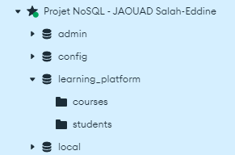

# JAOUAD Salah-Eddine

***

# Plateforme d'Apprentissage en Ligne - API Backend

Cette API sert de backend à une plateforme d'apprentissage en ligne. Elle utilise une architecture moderne avec MongoDB pour le stockage persistant et Redis pour le cache.

## Réponses aux questions (du code source)

### 1. Pourquoi utiliser des variables d'environnement ?
Les variables d'environnement sont utilisées pour **stocker des informations sensibles** (comme les URI de connexion à MongoDB et Redis) en dehors du code source. Cela permet :
- **Améliorer la sécurité** en évitant d'exposer des données sensibles dans le code.
- **Simplifier la configuration** pour différents environnements (développement, test, production).

---

### 2. Quelles sont les informations sensibles à ne jamais commiter ?
Les informations sensibles incluent :
- **Les URI de connexion** à MongoDB, Redis, ou d'autres services.
- **Les mots de passe et noms d'utilisateur**.
- **Les clés d'API ou secrets**.

Ces informations doivent être placées dans un fichier `.env` et ajoutées au `.gitignore` pour éviter leur exposition.

---

### 3. Pourquoi créer un module séparé pour les connexions aux bases de données ?
Créer un module dédié (ex. : `config/db.js`) pour les connexions permet :
- Une **meilleure organisation** du code.
- Une **réutilisation facile** des connexions dans toute l'application.
- Une **gestion centralisée** des erreurs et des mécanismes de retry.

---

### 4. Comment gérer proprement la fermeture des connexions ?
La fermeture propre des connexions évite les **fuites de mémoire** et les **erreurs inattendues**. Dans ce projet, cela est géré en écoutant l'événement `SIGTERM` :

```javascript
process.on('SIGTERM', async () => {
   await db.closeConnections();
   process.exit(0);
});
```

---

### 5. Pourquoi séparer la logique métier des routes ?
Séparer la logique métier des routes permet de :
- **Améliorer la maintenabilité** du code, en isolant la logique métier des aspects de gestion des requêtes HTTP.
- **Faciliter la réutilisation** de la logique métier dans différentes parties de l'application.
- **Simplifier les tests** en rendant les contrôleurs plus légers et plus faciles à tester indépendamment de la gestion des requêtes.

---

### 6. Pourquoi utiliser des services séparés ?
Les services tels que `mongoService.js` et `redisService.js` permettent d'encapsuler des opérations spécifiques aux technologies utilisées. Cela offre :
- **Une organisation claire** du code, en séparant les préoccupations.
- **Une réutilisation des fonctions utilitaires**, réduisant la duplication du code dans l'application.
- **Une gestion centralisée des responsabilités**, chaque service se concentrant sur une seule tâche, comme l'accès à la base de données ou le cache.

---

### 7. Comment gérer efficacement le cache avec Redis ?
Pour optimiser l'utilisation de Redis comme cache, il est recommandé de suivre ces bonnes pratiques :
- **Utiliser des clés cohérentes et descriptives** pour faciliter l'accès et la gestion des données en cache.
- Définir un **TTL (Time To Live)** pour chaque élément mis en cache afin de s'assurer qu'il soit supprimé après une certaine période, évitant ainsi des données obsolètes.
- Gérer les **erreurs de cache** de manière appropriée, en prévoyant des mécanismes de secours pour garantir que l'application continue de fonctionner même en cas d'indisponibilité temporaire de Redis.

## Installation

1. Cloner le repository :
```bash
git clone https://github.com/jaouad4/learning-platform-nosql.git
cd learning-platform-nosql
```

2. Installer les dépendances :
```bash
npm install
```

3. Configurer les variables d'environnement :
   Créer un fichier `.env` à la racine du projet avec :
```
MONGODB_URI=mongodb://localhost:27017
MONGODB_DB_NAME=elearning
REDIS_URI=redis://localhost:6379
PORT=3000
```

4. Lancer l'application :
```bash
npm start
```

## Structure du Projet

```
.
├── .env                  # Fichier de configuration des variables d'environnement
├── package.json          # Liste des dépendances et scripts de l'application
├── app.js                # Point d'entrée de l'application
├── config/               
│   ├── db.js             # Configuration des connexions aux bases de données
│   └── env.js            # Gestion des variables d'environnement
├── api/ 
│   └── test.js # Test de l'API
├── controllers/          
│   └── courseController.js # Logique métier des routes
├── routes/               
│   └── courseRoutes.js    # Définition des routes
└── services/             
    ├── mongoService.js    # Services pour MongoDB
    └── redisService.js    # Services pour Redis
```

## Choix Techniques

### 1. Architecture en Couches
- **Routes** : Définition des endpoints de l'API
- **Contrôleurs** : Logique métier et gestion des requêtes/réponses
- **Services** : Logique réutilisable et abstraction des accès aux données
- **Config** : Configuration et initialisation des composants

### 2. Bases de données
- **MongoDB** : Stockage principal des données (documents flexibles)
- **Redis** : Cache pour optimiser les performances

### 3. Gestion des erreurs
- Validation des variables d'environnement au démarrage
- Gestion des connexions avec retry
- Arrêt gracieux du serveur

## Simulation de l'application

### Configuration de MongoDB avec Compass
1. **Connexion à MongoDB** :
   - Ouvrez MongoDB Compass.
   - 
   - Connectez-vous à `mongodb://localhost:27017`.
   - 

2. **Vérification des données dans MongoDB** :
   - Une fois connecté, accédez à la base de données `elearning`.
   - Visualisez les collections et les documents.
   - 

### Configuration de Redis
1. **Connexion avec Redis** :
   - Après installer Redis, éxecutez le commande ```redis-server``` pour lancer le serveur Redis.
   - - 

### Simulation de l'application

1. **Lancer l'application** :
    - Executez le commande ```node app.js``` pour lancer l'application.
    - 

2. **Tester les routes des cours** :
   - **POST /courses** : Ajoutez un nouveau cours.
   ```bash
    curl -X POST http://localhost:3000/api/courses -H "Content-Type: application/json" -d "{\"title\": \"<titre>\", \"description\": \"I<description>\"}"
    ```
   - 
   - 
    
   - **GET /courses** : Récupérez la liste des cours.
   ```bash
    ccurl -X GET http://localhost:3000/api/courses/<course_id>
   ```
   - 

3. **Tester les routes des étudiants** :
   - **POST /students** : Ajoutez un nouvel étudiant.
     ```bash
     curl -X POST http://localhost:3000/api/students -H "Content-Type: application/json" -d "{\"name\": \"<nom>\", \"email\": \"<email>\"}"
     ```
   - 
   - 
   - 
   - 

### Vérification des données ajoutées dans MongoDB
- Retournez dans MongoDB Compass et vérifiez que les nouvelles données (cours et étudiants) sont bien enregistrées.
- 

---

Ce travail a été réalisé par **JAOUAD Salah-Eddine**.

